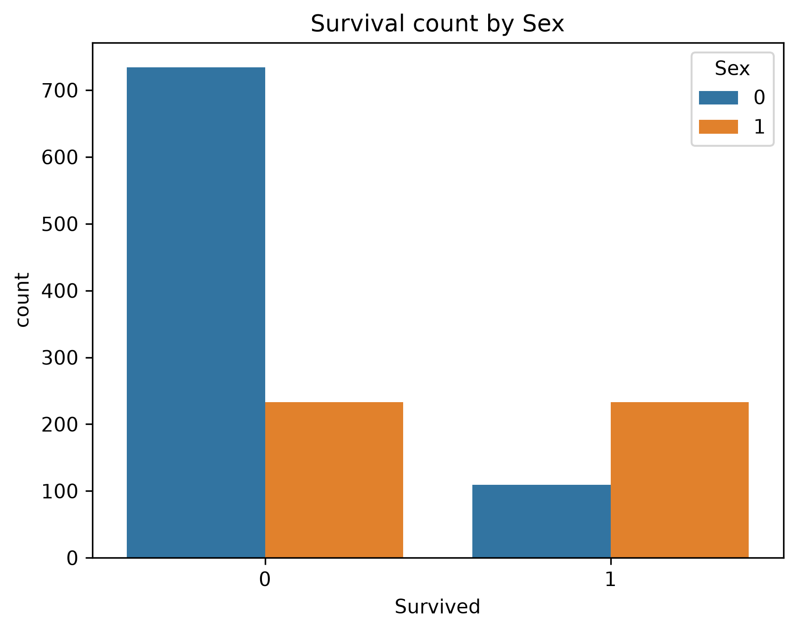
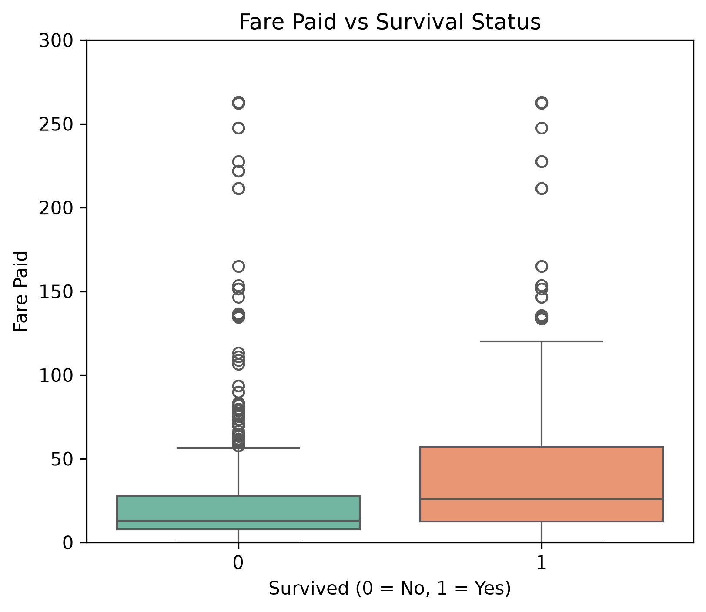
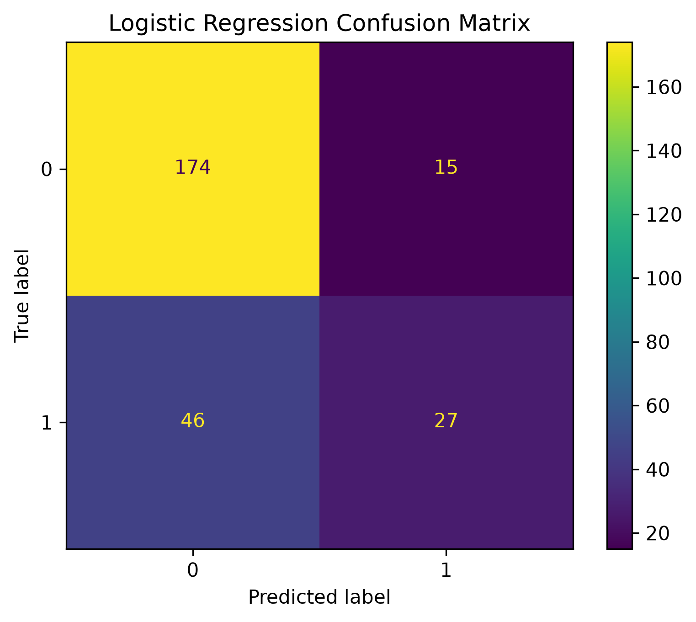
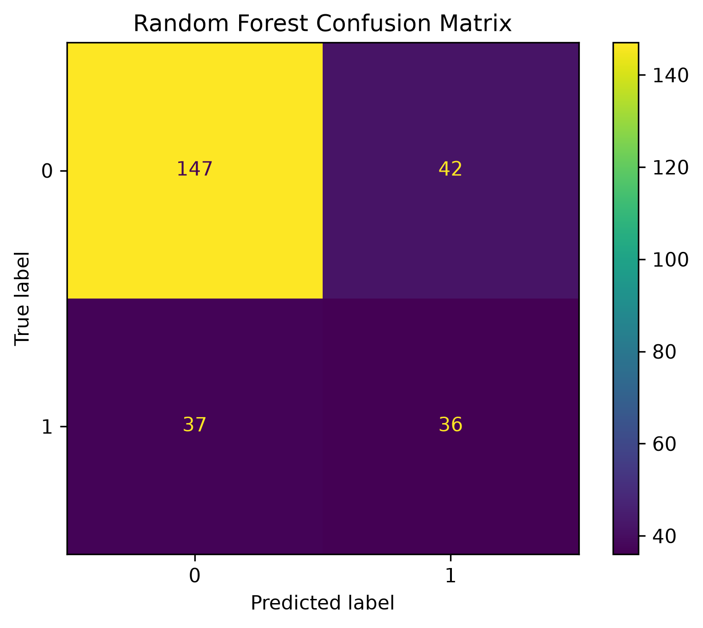

# Titanic Survival Prediction 🚢

A machine learning classification project that predicts passenger survival on the Titanic using two supervised learning algorithms: **Logistic Regression** and **Random Forest Classifier**.

---

# Project Overview

The goal of this project is to build and compare machine learning models capable of predicting whether a passenger survived the Titanic disaster.

The project follows a complete machine learning workflow:

- Data Cleaning
- Handling Missing Values
- Exploratory Data Analysis (EDA)
- Feature Selection
- Train-Test Split
- Model Training
- Model Evaluation
- Model Comparison

---

# Dataset

The project uses the **Titanic passenger dataset**.

### Features Used

- Passenger Class (Pclass)
- Sex
- Age
- Fare
- Number of Siblings/Spouses (sibsp)
- Number of Parents/Children (Parch)
- Embarked

### Target Variable

- **Survived**
    - 0 = Did Not Survive
    - 1 = Survived

---

# Data Preprocessing

The following preprocessing steps were performed:

- Removed unnecessary columns
- Checked for missing values
- Filled missing values in the **Embarked** column using the mode
- Selected relevant features for prediction
- Split the dataset into training and testing sets

---

# Exploratory Data Analysis

## Survival by Sex

Female passengers exhibited a much higher survival rate than male passengers, making **Sex** one of the strongest predictors of survival.

---

## Survival by Passenger Class

Passengers travelling in **First Class** had a considerably higher survival rate than those travelling in **Third Class**.

---

## Fare Paid vs Survival

Passengers paying higher fares generally had better survival outcomes, suggesting a relationship between fare and survival probability.

---

## Age Distribution by Survival

The age distributions of survivors and non-survivors overlap considerably, indicating that age alone is not a strong predictor of survival.

---

# Machine Learning Models

Two classification models were trained and compared.

## Logistic Regression

**Accuracy:** **76.7%**

### Confusion Matrix

**Observations**

- Highest overall accuracy
- Correctly classified most non-survivors
- Produced fewer false positives than Random Forest

---

## Random Forest Classifier

**Accuracy:** **70.2%**

### Confusion Matrix

**Observations**

- Correctly identified more survivors
- Produced more false positives
- Lower overall accuracy on this dataset

---

# Model Comparison

| Model | Accuracy |
|--------|----------|
| Logistic Regression | **76.7%** |
| Random Forest Classifier | **70.2%** |

Although Random Forest is generally considered a more complex model, Logistic Regression performed better on this dataset. This highlights the importance of evaluating multiple models instead of assuming that a more sophisticated algorithm will always produce better results.

---

# Key Learnings

Through this project, I gained practical experience in:

- Data cleaning and preprocessing
- Handling missing values
- Exploratory Data Analysis (EDA)
- Feature selection
- Splitting data into training and testing sets
- Training classification models
- Evaluating models using confusion matrices
- Comparing multiple machine learning algorithms
- Interpreting model performance beyond accuracy alone

---

# Technologies Used

- Python
- Pandas
- NumPy
- Matplotlib
- Seaborn
- Scikit-learn
- Jupyter Notebook

---

# Future Improvements

Possible improvements include:

- Hyperparameter tuning
- Cross-validation
- Feature engineering
- Testing additional classification models (SVM, XGBoost)
- Deploying the model using Streamlit

---

# Author

**Vineeth T P**

Machine Learning enthusiast focused on building practical, end-to-end ML projects.

